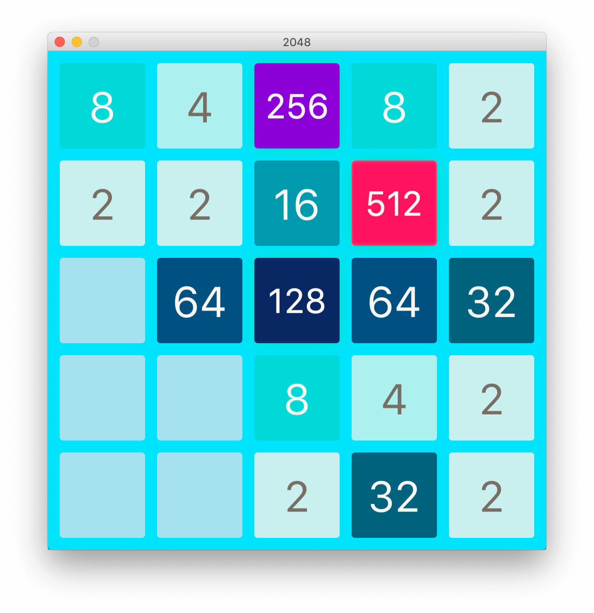

# 2048 in JavaFx

Re-implementation of the famous 2048 game in Java 8 using JavaFx.

## Building

[bin] and [src/org/frendo/game2048/Main.java] are the path of output and input.

```bash
javac -d bin -sourcepath src src/org/frendo/game2048/Main.java
```

## Running

[bin] is the path of output.

```bash
java -cp bin org.frendo.game2048.Main
```

## Final


<div align=center></div>


